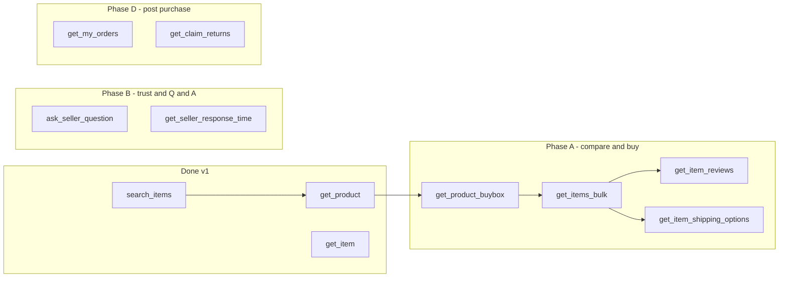

# Buyer agent — Mercado Libre API & MCP tool roadmap

Maps your [buyer journey requirements](#journey-to-api-coverage) to what [@kolmena-ai/meli-mcp](.) implements today, what the [official API](https://developers.mercadolibre.com.ar/en_us/api-docs) supports, and what is **not** available via API (agent/skill/Kolmena only).

**Auth model:** Almost all buyer-valuable calls need a user OAuth token (`APP_USR-…`). The MCP server reads `MERCADOLIBRE_ACCESS_TOKEN`. Post-purchase tools additionally require the token to belong to the **buyer** (`/users/me` + `orders/search?buyer=`).

---

## Journey → API coverage

| # | Journey area | Mostly API? | Today in meli-mcp | Gap severity |
|---|----------------|-------------|-------------------|--------------|
| 1 | Understand intent | Agent (LLM + memory) | — | N/A — skill/character |
| 2 | Search & discover | **Partial** | `search_items` (catalog only) | **High** — no marketplace keyword search |
| 3 | Compare products | **Partial** | `get_product`, `get_item` (fallback) | **High** — need prices, shipping, reviews in bulk |
| 4 | Seller trust | **Yes** | `get_seller_info` | Medium — enrich reputation + Q&A latency |
| 5 | Ask seller questions | **Yes** | — | Medium — POST question + read Q&A |
| 6 | Purchase decision | Agent + API data | partial data | Depends on #2–#5 |
| 7 | Price monitoring | **No** (no public history API) | — | Kolmena jobs + stored snapshots |
| 8 | Payment / installments | **Partial** | `get_currency_conversion` | Medium — installments on item/order |
| 9 | Shipping | **Partial** | — | Medium — per-item + per-order shipment |
| 10 | Post-purchase | **Yes** (buyer token) | — | High — orders, shipments, claims |
| 11 | Category expertise | Agent + attributes API | `get_category` | Medium — domain/category attributes |
| 12 | Fraud / risk | Agent heuristics | partial | Skill rules + item/product fields |
| 13 | Concierge / lists | Kolmena memory | — | N/A — platform feature |

---

## Critical architecture note: catalog vs listings

Your fork correctly uses [**Products search**](https://developers.mercadolibre.com.ar/en_us/news/products-search):

```http
GET /products/search?site_id=MLA&status=active&q=...
```

That returns **catalog product ids** (PDP / datasheet), not every marketplace listing with price and seller.

| ID type | Example | Get detail | Has live price / seller / shipping |
|---------|---------|------------|-------------------------------------|
| Catalog product | `MLA55016525` | `GET /products/{id}` | Often via `buy_box_winner` only |
| Marketplace listing | `MLA903218023` | `GET /items/{id}` | Yes |

Legacy **public keyword listing search**:

```http
GET /sites/MLA/search?q=iphone
```

is documented in [Items & searches](https://developers.mercadolibre.com.ar/en_us/items-and-searches) but is **403/forbidden** for many apps (including yours). Do not build the buyer agent around it until Mercado Libre enables it for your `client_id` or documents an alternative.

**Listing discovery options today:**

1. **`GET /products/{id}`** — fields `buy_box_winner`, `buy_box_winner_price_range`, `permalink` ([catalog product](https://developers.mercadolibre.com.ar/en_us/news/products-search)).
2. **`GET /products/{product_id}/items`** — lists competing listings on the PDP — **being shut down** (docs: use before 2025-10-01; migrate to `buy_box_winner` + [`/items/{id}/price_to_win`](https://developers.mercadolibre.com.ar/en_us/manage-packages/catalog-competition)).
3. **`GET /sites/{site}/search?seller_id=`** — all listings from one seller ([Items & searches](https://developers.mercadolibre.com.ar/en_us/items-and-searches)).
4. **Official store / known seller** — combine seller search + multiget.

There is **no** documented replacement for open-marketplace `?q=` keyword search with the same shape as the old `/sites/.../search` response.

**Recommendation:** Treat buyer search as **catalog discovery → resolve buy box / winner listing → multiget compare**. Escalate to Mercado Libre DevCenter for listing-level keyword API for your app.

---

## Listing search without DevCenter (`search_buyable_listings`)

When `GET /sites/MLA/search?q=` returns **403**, use the composite tool **`search_buyable_listings`** (or the same chain in a skill):

1. `search_items` (catalog)
2. `get_product` / buy box per hit
3. `GET /items/{buy_box_winner}`
4. Filter `price <= price_max`
5. `get_seller_info` for reputation

This answers *“laptops under ARS X with seller ratings”* for **buy-box offers on products matching the query**, not every obscure listing on the site. For one trusted seller, add `search_listings_by_seller`.

---

## Current tools (v1.1.0-kolmena.0)

| MCP tool | API | Buyer journey |
|----------|-----|---------------|
| `search_items` | `GET /products/search` | #2 Discover (catalog) |
| `search_buyable_listings` | composite (catalog → buy box → items → sellers) | #2–#3 **price + seller filter** |
| `search_listings` | `GET /sites/.../search?q=` (403 → fallback hint) | #2 if app allowed |
| `search_listings_by_seller` | `GET /sites/.../search?seller_id=` | #2 trusted seller |
| `get_product` / `get_product_buybox` | `GET /products/{id}` | #2–#3 |
| `get_product_listings` | `GET /products/{id}/items` (deprecated) | #3 competitors |
| `get_item` / `get_items_bulk` | `GET /items/{id}`, multiget | #3–#4 |
| `compare_products` | composite | #3–#6 |
| `get_item_reviews` | `GET /reviews/item/{id}` | #4, #12 |
| `get_item_shipping_options` | `GET /items/{id}/shipping_options` | #3, #9 |
| `get_item_sale_terms` | from item | #8 installments |
| `get_category_attributes` | `GET /categories/{id}/attributes` | #11 |
| `get_domain_discovery` | domain discovery search | #2 intent → domain |
| `get_seller_info` / `get_seller_response_time` | users API | #4–#5 |
| `get_item_questions` / `ask_seller_question` / `get_question` | questions API | #5 |
| `get_me` / `get_my_orders` / `get_order` / shipments / discounts / feedback | orders API | #9–#10 |
| `search_my_claims` / `get_claim` / `get_claim_returns` | post-purchase | #10 |
| `get_categories` / `get_category` / `get_trends` / `get_currency_conversion` | misc | #2, #8 |

---

## Recommended new MCP tools (by phase)

### Phase A — Pre-purchase discovery & comparison (highest value)

Aligns with #2, #3, #6, #8 (shipping preview), #11, #12.

| Proposed tool | Method & endpoint | Purpose |
|---------------|-------------------|---------|
| `get_product_buybox` | `GET /products/{id}` (parse `buy_box_winner`, `permalink`, price range) | Single-call “best offer” for a catalog id |
| `get_items_bulk` | `GET /items?ids=ID1,ID2,...` (max 20) | Comparison table: price, shipping flag, condition, seller_id ([Items & searches](https://developers.mercadolibre.com.ar/en_us/items-and-searches)) |
| `get_item_reviews` | `GET /reviews/item/{item_id}` optional `?catalog_product_id=` | #4, #12 — stars, text ([Product reviews](https://developers.mercadolibre.com.ar/en_us/manage-packages/products-reviews)) |
| `get_item_shipping_options` | `GET /items/{item_id}/shipping_options` | #9 — cost, delivery type ([Shipping](https://developers.mercadolibre.com.ar/en_us/shipping)) |
| `get_category_attributes` | `GET /categories/{id}/attributes` | #11 — specs grid for category |
| `get_domain_discovery` | `GET /domains/{domain_id}/discovery` or site domain search | Normalize “laptop for university” → domain / filters |
| `search_listings_by_seller` | `GET /sites/{site}/search?seller_id=` or `GET /users/{id}/items/search` | When user picks a trusted seller/store |
| `get_official_store` | `GET /stores/{store_id}` + search with `official_store` filter | Brand storefront trust |
| `get_product_listings` | `GET /products/{id}/items` **only while not deprecated** | Fallback competitor listings; plan removal |

**Orchestration tool (optional composite):** `compare_products` — accepts 2–5 ids, runs multiget + reviews + shipping internally, returns a comparison-shaped JSON for the LLM. Reduces round-trips; logic can also live in a **skill** instead.

**Blocked / investigate with ML:**

| Need | Endpoint | Status |
|------|----------|--------|
| Keyword marketplace search | `GET /sites/{site}/search?q=` | 403 for your app — **DevCenter ticket** |
| PDP all competing listings | `GET /products/{id}/items` | **Deprecated** — use buy box + seller search |

---

### Phase B — Seller trust & pre-sale Q&A (#4, #5)

| Proposed tool | Method & endpoint | Purpose |
|---------------|-------------------|---------|
| `get_seller_response_time` | `GET /users/{id}/questions/response_time` | Seller responsiveness ([Questions](https://developers.mercadolibre.com.ar/en_us/manage-questions-and-answers)) |
| `get_item_questions` | `GET /questions/search?item={id}&api_version=4` | Existing Q&A on listing |
| `ask_seller_question` | `POST /questions` body `{ text, item_id }` | Draft & send (rate-limit; skill: max 1–2 per listing) |
| `get_question` | `GET /questions/{id}?api_version=4` | Poll answer |

**Not in API:** spam detection, “evasive answer” scoring — **agent** analyzes text.

---

### Phase C — Payments & total cost (#8)

| Proposed tool | Method & endpoint | Purpose |
|---------------|-------------------|---------|
| `get_item_sale_terms` | From `GET /items/{id}` → `sale_terms`, `installments`, `original_price` | Installments, warranty terms |
| `get_order_payment_info` | `GET /orders/{id}` → `payments[]` | After purchase only |
| `get_order_discounts` | `GET /orders/{id}/discounts` | Coupons, campaigns ([Manage sales](https://developers.mercadolibre.com.ar/en_us/manage-sales)) |

**Not in API / out of scope for MCP:**

- Executing payment, storing card data, applying coupons at checkout — **never**; user stays in ML/MP checkout.
- Global “best installment across cart” without order context — approximate from item `sale_terms` only.

---

### Phase D — Post-purchase (#9, #10) — **buyer OAuth required**

Requires token from the **buyer’s** Mercado Libre account (separate from seller `meli-api` skill).

| Proposed tool | Method & endpoint | Purpose |
|---------------|-------------------|---------|
| `get_my_orders` | `GET /orders/search?buyer={me}` | Order list |
| `get_order` | `GET /orders/{id}` | Status, items, payments |
| `get_order_shipment` | `GET /orders/{id}/shipments` or `GET /shipments/{id}` | Tracking, ETA ([Shipping](https://developers.mercadolibre.com.ar/en_us/shipping)) |
| `get_order_feedback` | `GET /orders/{id}/feedback` | Post-sale rating state |
| `search_my_claims` | `GET /post-purchase/v1/claims/...` (search by user/order) | Claims list ([Working with claims](https://developers.mercadolibre.com.ar/en_us/manage-packages/working-with-claims)) |
| `get_claim` | `GET /post-purchase/v1/claims/{id}` | Claim detail + actions |
| `get_claim_returns` | `GET /post-purchase/v2/claims/{id}/returns` | Return status ([ML returns](https://developers.mercadolibre.com.ar/en_us/product-identifiers/ml-returns)) |
| `send_claim_message` | POST on claim actions | Draft messages (careful with attachments) |

**Notifications:** Subscribe to order/shipment/claim topics via ML notifications API + Kolmena worker — not synchronous MCP tools.

---

### Phase E — Monitoring & deals (#7) — **mostly Kolmena, not ML**

| Capability | Approach |
|------------|----------|
| Price watch | Periodic `GET /items/{id}` or `GET /products/{id}`; store in Kolmena DB; alert via heartbeat |
| “Real discount” | Compare `price` vs `original_price` on item over time (your snapshots) |
| Campaigns (Hot Sale) | No stable public “all deals” API documented — scrape trends + `get_trends` + promotions in item payload when present |
| Saved search | **No** ML “saved search” API for third parties — Kolmena stores criteria and re-runs `search_items` |

---

## What should NOT be MCP tools

| Capability | Why |
|------------|-----|
| Clarifying questions, comparison narrative, “avoid” recommendation | LLM + **skill** (workflow), not HTTP |
| Remember preferences, shopping lists, replenishment | Kolmena **memory** / user profile |
| Fraud heuristics (counterfeit, misleading title) | **Skill** rules + structured checks on item/product fields |
| Category expert playbooks (auto parts fitment, fashion sizing) | **Skills** per vertical + optional future fitment API if ML grants |
| Payment execution | User-only in ML/Mercado Pago UI |
| Multi-retailer comparison (Amazon vs ML) | Other integrations |

---

## Suggested implementation priority



| Priority | Tools | Unblocks |
|----------|-------|----------|
| **P0** | `get_product_buybox`, `get_items_bulk`, `get_item_reviews`, `get_item_shipping_options` | Comparison tables, total cost, trust (#3, #6) |
| **P1** | `get_item_questions`, `ask_seller_question`, `get_seller_response_time` | Pre-sale Q&A (#5) |
| **P1** | DevCenter: enable `sites/search?q=` or official listing search | True marketplace keyword search (#2) |
| **P2** | `get_my_orders`, `get_order`, `get_order_shipment` | Post-purchase (#9–#10) |
| **P2** | `search_my_claims`, `get_claim`, `get_claim_returns` | Returns/refunds (#10) |
| **P3** | Kolmena price-watch worker + memory | #7 |
| **Later** | Domain attributes, official stores, category attributes | #11 specialist modes |

---

## Auth & product split (buyer vs seller)

| Integration | Token | MCP package |
|-------------|-------|-------------|
| **Buyer agent (Camila)** | Buyer OAuth `APP_USR` in `MERCADOLIBRE_ACCESS_TOKEN` or per-user via Bifrost later | `@kolmena-ai/meli-mcp` |
| **Seller agents** | `MELI_REFRESH_TOKEN` + client id/secret | Keep **`meli-api` skill** (shell) until seller tools move into meli-mcp |

Do not merge seller order APIs into the buyer MCP without clear tool naming (`seller_*` vs `buyer_*`) and separate skills.

---

## Skill vs MCP (your next step)

MCP should expose **atomic, documented APIs**. A **`meli-buyer` skill** should define:

1. Intent → `search_items` with structured criteria  
2. `get_product` + `get_product_buybox` on top 3–5 ids  
3. `get_items_bulk` on winner listing ids  
4. `get_item_reviews` + `get_item_shipping_options`  
5. Score risks (#12) and output recommendation (#6)  
6. Optional `ask_seller_question` only if material  
7. Post-purchase path only if buyer token + `get_my_orders` exists  

Finish MCP through **Phase A** before writing the skill so the skill references stable tool names.

---

## References

- [Products search](https://developers.mercadolibre.com.ar/en_us/news/products-search)
- [Items & searches](https://developers.mercadolibre.com.ar/en_us/items-and-searches)
- [Manage questions & answers](https://developers.mercadolibre.com.ar/en_us/manage-questions-and-answers)
- [Product reviews](https://developers.mercadolibre.com.ar/en_us/manage-packages/products-reviews)
- [Catalog competition / price_to_win](https://developers.mercadolibre.com.ar/en_us/manage-packages/catalog-competition)
- [Manage sales / orders](https://developers.mercadolibre.com.ar/en_us/manage-sales)
- [Shipping](https://developers.mercadolibre.com.ar/en_us/shipping)
- [Working with claims](https://developers.mercadolibre.com.ar/en_us/manage-packages/working-with-claims)
- [ML returns (post-purchase)](https://developers.mercadolibre.com.ar/en_us/product-identifiers/ml-returns)
